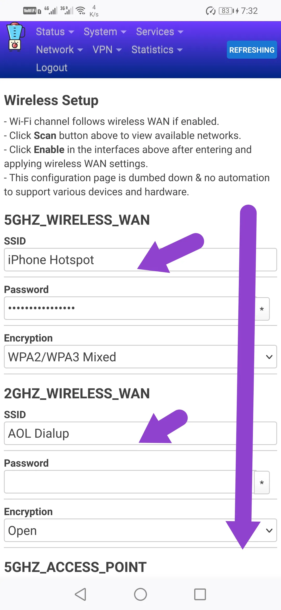

<b>Speedify users: Free accounts are not supported (last update: March 2023)</b>
<h2>Installation using a smartphone as an example for quick setup</h2>
<b>Note:</b> Slate AX or Flint is recommended for ease of use due to built in stable Wi-Fi adapters, no extra hardware is needed. 
  
- Download and follow the instructions from the [release](https://github.com/TalalMash/SmoothWAN/releases) page.  
- Connect your hardware in a similar way to this example:  

{: style="max-height:700px;border:6px solid #d2ccf1;"}
{: style="max-height:700px;border:6px solid #d2ccf1;"}

- The Slate or Flint is now broadcasting as a Wi-Fi access point for easy configuration, disable mobile data and connect your phone to Wi-Fi `SmoothWAN Setup 2.4 or 5Ghz` with password: `brassworld`.  
- In your browser, visit: http://172.17.17.2 there is no password set:  

{: style="max-height:700px;border:6px solid #d2ccf1;"}
{: style="max-height:700px;border:6px solid #d2ccf1;"}

- You will be greeted with brief instructions in the UI, if you need to connect to a Wi-Fi network to bond and use (WWAN), you can do up to 2 with 5G and 2.4G, skip the following steps if all your internet sources to be used (WAN) by Speedify are wired, head to `Simple Wi-Fi Setup`: 

{: style="max-height:700px;border:6px solid #d2ccf1;"}
{: style="max-height:700px;border:6px solid #d2ccf1;"}

**You can also change your access point SSID/Password here!**

{: style="max-height:700px;border:6px solid #d2ccf1;"}

**Enable the wireless WANs that you have configured**

{: style="max-height:700px;border:6px solid #d2ccf1;"}
{: style="max-height:700px;border:6px solid #d2ccf1;"}

**With all your WANs now configured, install Speedify:**

{: style="max-height:700px;border:6px solid #d2ccf1;"}
{: style="max-height:700px;border:6px solid #d2ccf1;"}
{: style="max-height:700px;border:6px solid #d2ccf1;"}

**All done!**

You can change your password in the administration page.
{: style="max-height:700px;border:6px solid #d2ccf1;"}

***
**Note**

Few devices are problematic with SmoothWAN built-in interface renamer (the unique name shown in the example as `USB_1f16`), you can disable this option in Speedify configuration page menu -> Options. The adapter naming will be named by the order of first detection e.g `usb0`, `usb1` which can be random on every power up. 
For data cap limit users, Speedify won't be able to tell which WAN to limit persistently in this mode.

{: style="max-height:700px;border:6px solid #d2ccf1;"}