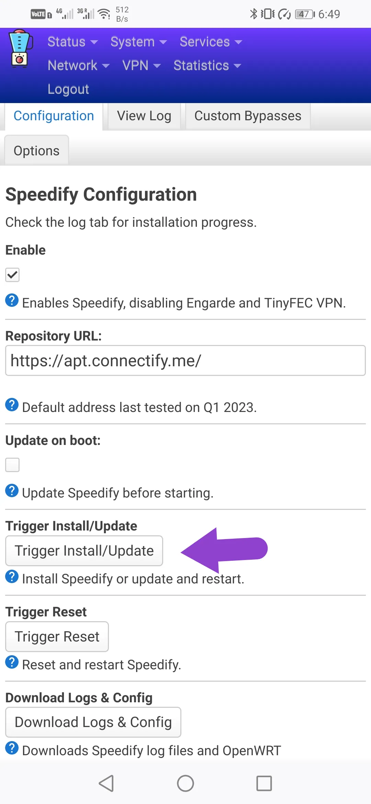
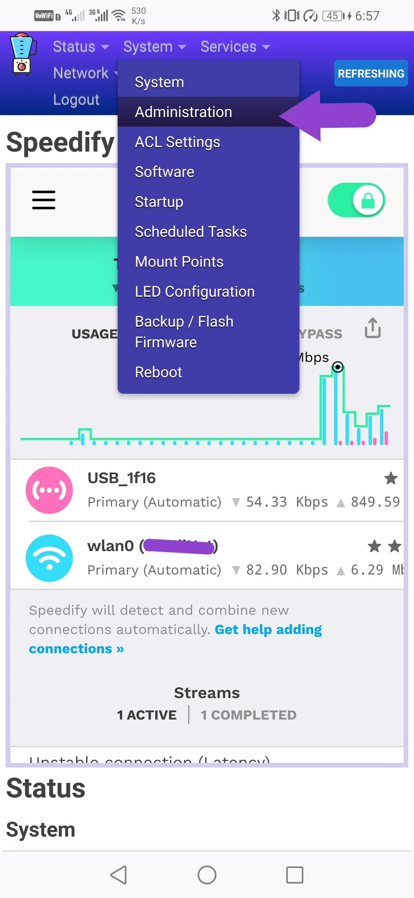
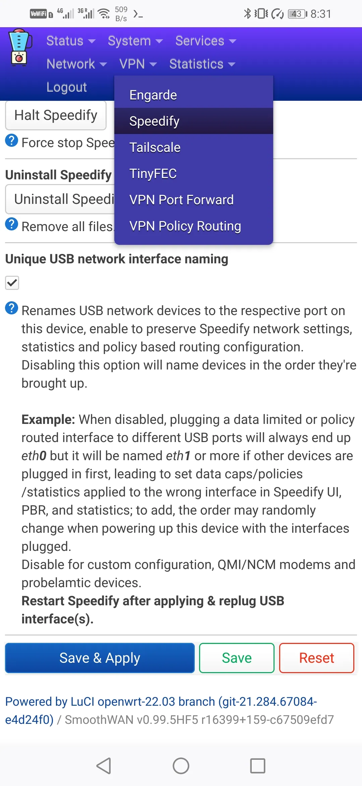

<b>Speedify users: Free accounts are not supported (last update: August 2023)</b>

*Raspberry Pis are now hard to source, the current support is community testing, few screenshots are not up to date and may look slightly different.*
<h2>Setup</h2>

- Download and follow the instructions from the [release](https://github.com/TalalMash/SmoothWAN/releases) page.
- Connect your wired internet connections (if available):

{: style="max-height:700px;border:6px solid #d2ccf1;"}

- The Pi is now broadcasting as a Wi-Fi access point, disable mobile data and connect your phone to Wi-Fi `SmoothWAN Setup` with password: `brassworld`. 
- For PC or x86 router (Protectli, Qotom etc) users, use the first wired LAN port and a laptop instead of smartphone.
- In your browser, visit: http://172.17.17.2 there is no password set: 

{: style="max-height:700px;border:6px solid #d2ccf1;"}

{: style="max-height:700px;border:6px solid #d2ccf1;"}

**Install Speedify:**

{: style="max-height:700px;border:6px solid #d2ccf1;"}

{: style="max-height:700px;border:6px solid #d2ccf1;"}

{: style="max-height:700px;border:6px solid #d2ccf1;"}

{: style="max-height:700px;border:6px solid #d2ccf1;"}

**All done!**

You can change your web login password in the administration page.
{: style="max-height:700px;border:6px solid #d2ccf1;"}

???+ tip "Change WAN Names"

    To change the USB ports / WAN name, head to Interfaces->Multi-WAN USB:

    {: style="max-height:700px;border:6px solid #d2ccf1;"}

    {: style="max-height:700px;border:6px solid #d2ccf1;"}

    {:    style="max-height:700px;border:6px solid #d2ccf1;"}

???+ tip "Using a Wi-Fi router or a Wi-Fi access point"

    The internal Wi-Fi of the Pi is unstable for general use, connect using RPi4's Ethernet port to a configured AP/router:

    {: style="max-height:700px;border:6px solid #d2ccf1;"}

    {: style="max-height:700px;border:6px solid #d2ccf1;"}

    After connecting your mobile over the Wi-Fi AP/router, head over to Network->Wireless and disable Pi's Wi-Fi:

    {: style="max-height:700px;border:6px solid #d2ccf1;"}

    , you can disable this option in Speedify navigation menu -> Options. The adapter naming will be named by the order of first detection e.g `usb0`, `usb1` which can be random on every power up. 
For data limited users, Speedify won't be able to tell which USB connected adapter corresponds to the set data limits and statistcs.

{: style="max-height:700px;border:6px solid #d2ccf1;"}
