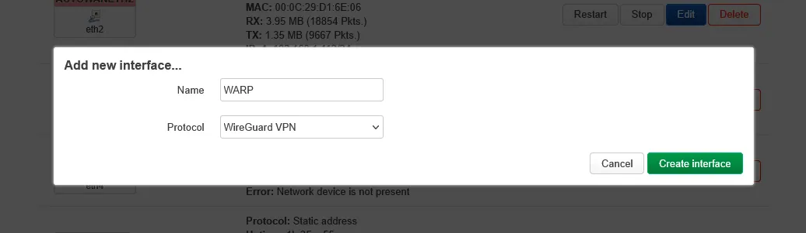
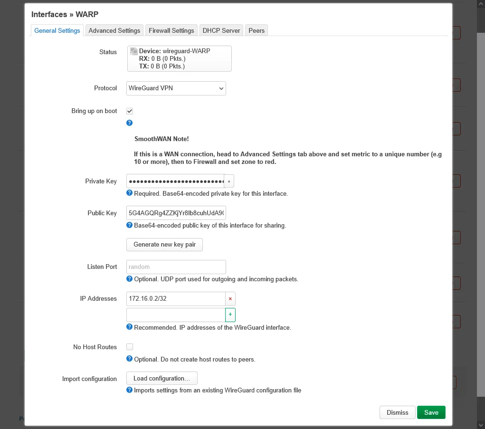
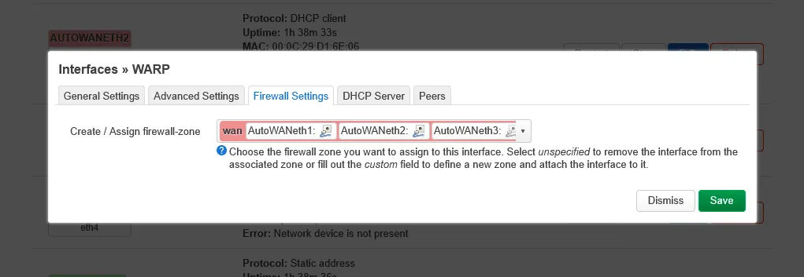
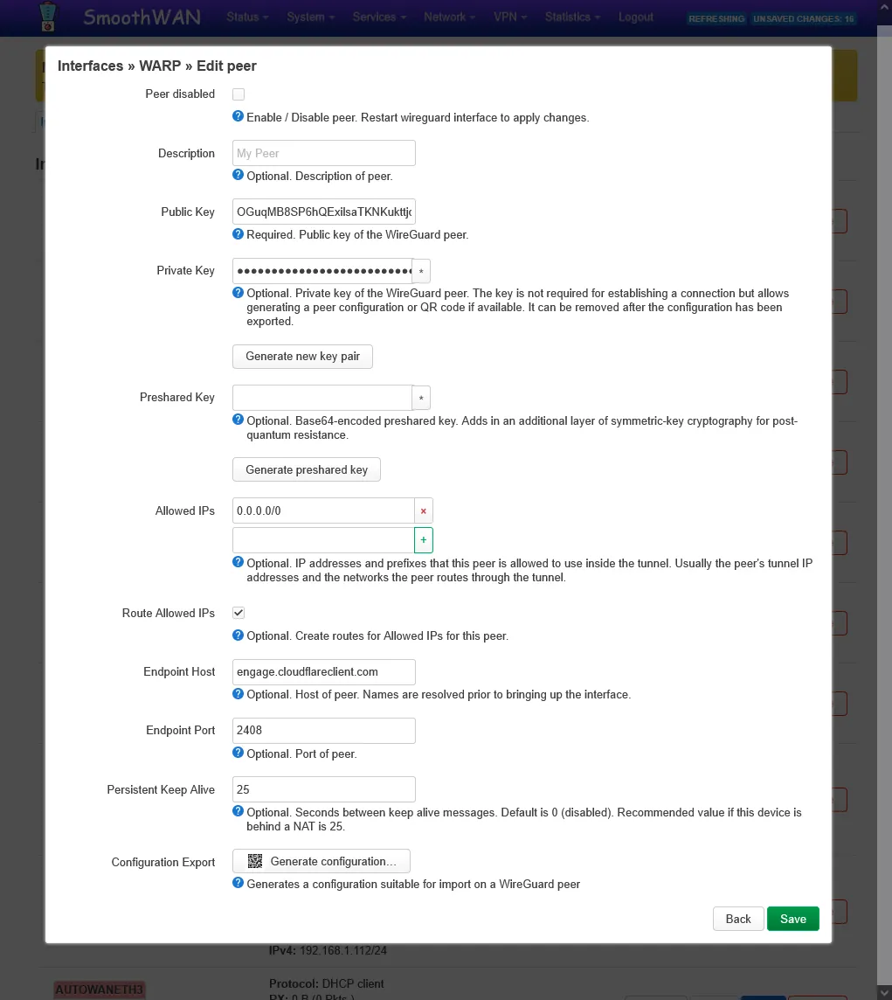

## Tunneling all clients to a VPN over Speedify/Engarde/TinyFEC

1. Setup your VPN as you would in any OpenWrt router, many VPN providers provide instructions for OpenWrt.

??? note "WireGuard VPN example"

    "A screenshot is worth a thousand words".

    Cloudflare WARP VPN example:

    {: style="max-height:700px;border:6px solid #d2ccf1;"}
    {: style="max-height:700px;border:6px solid #d2ccf1;"}
    {: style="max-height:700px;border:6px solid #d2ccf1;"}
    {: style="max-height:700px;border:6px solid #d2ccf1;"}

??? note "OpenVPN example"

    - TODO

2. Edit your VPN configuration in *Network* -> *Interface* -> *Edit* next to the VPN interface and select one of the `BYP` tables in *Advanced Settings* tab -> *Override IPv4 routing table* (as well as IPv6 if used), there are 10 presets. 
3. Add an IP rule by going to *Network* -> *Routing* -> *IPv4 Rules* -> *Add* button.
4. Enter your LAN IP range in *Source*, by default it is `172.17.17.0/24` and select the `BYP` table you chose earlier.
5. Add a static route by going to *Network* -> *Routing* -> *Static IPv4 Routes* -> *Add* button.
6. Choose `lan` in *Interface* and enter your LAN IP range in *Target*, by default it is `172.17.17.0/24` and select the `BYP` table you chose earlier in *Advanced Settings* tab.
7. *Save and Apply*, confirm that your IP address has changed from the bypassed clients.

To tunnel specific clients/IP addresses to the VPN, treat the VPN interface as a WAN, and follow the steps in  instead of this guide.